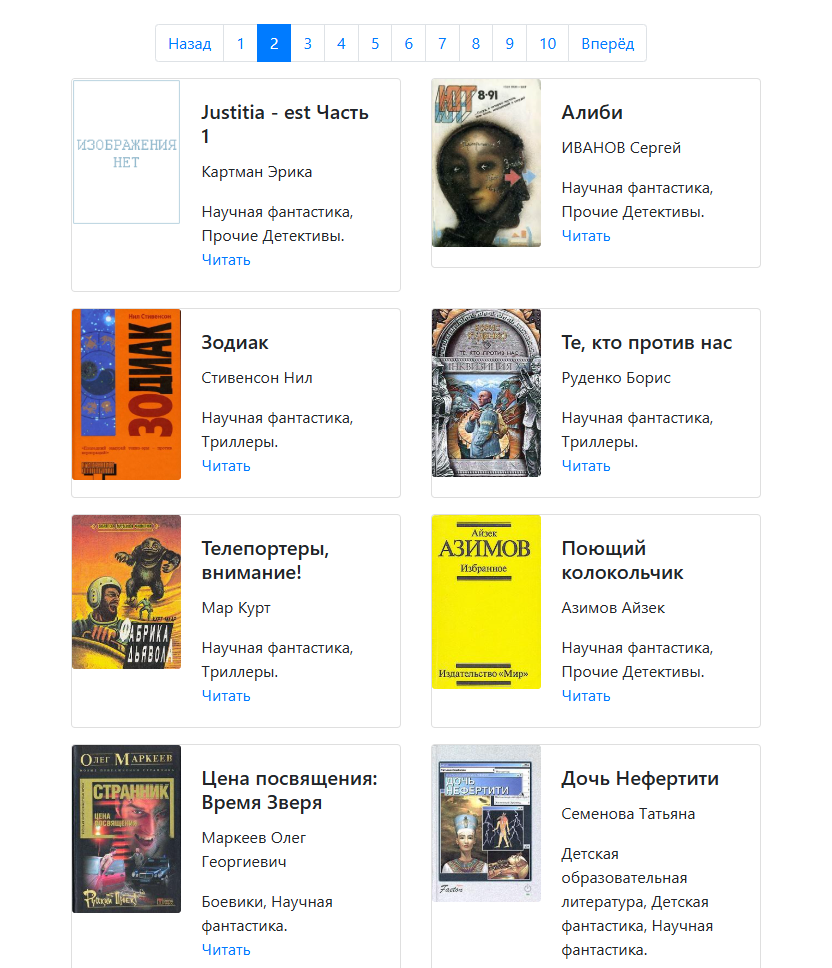
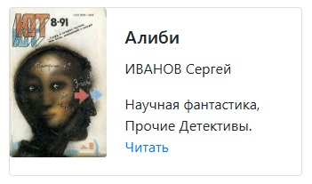

# Сайт-библиотека

## Описание
[Простая онлайн библиотека.](https://alexklos.github.io/DVMN_l20/pages/index1.html)

## Как пользоваться
На страницах сайта представлены карточки с различными книгами:



В каждой карточке указано название книги, автор, стиль, и дана ссылка на текст книги:



Переход между страницами осуществляется с помощью панели навигации:


## Локальное использование

Для локального запуска на своём ПК:
- Скачайте и распакуйте в папку проекта архив [for_local_start.zip](https://github.com/AlexKlos/DVMN_l20/blob/master/for_local_start.zip)
- в папке pages/ откройте с помощью браузера любой .html файл
- Используйте библиотеку согласно инструкции (см. выше)

## Полная установка

- Клонируйте [репозиторий](https://github.com/AlexKlos/DVMN_l20)
   ```bash
   git clone https://github.com/AlexKlos/DVMN_l20
   ```
- Установите зависимости
   ```bash
   pip install -r requirements.txt
   ```
- Запустите сервер
   ```
   python server.py
   ```
- При успешном запуске сервера выведет сообщение в консоль
   ```
   Site rebuild
   Serving on http://127.0.0.1:35729
   ```
- Сайт будет доступен по адресу http://127.0.0.1:8000/pages/index1.html

### Структура проекта
   ```
   project_root/
   ├─ server.py                     # Основной серверный скрипт с livereload и генерацией страниц
   ├─ template.html                 # Jinja-шаблон для генерации страниц
   ├─ meta_data.json                # Исходные данные о книгах
   ├─ requirements.txt              # Зависимости
   ├─ media/
   |  ├─ books/                     # Тексты книг в формате .txt
   |  └─ img/                       # Обложки книг и другие изображения
   ├─ pages/                        # Сгенерированные HTML-страницы библиотеки
   └─ static/                       # Локальные JS и CSS
      ├─ bootstrap.min.css
      ├─ bootstrap.bundle.min.js
      └─ jquery-3.5.1.slim.min.js
   ```

- Скрипт генерирует страницы на основе шаблона template.html и метаданных meta_data.json

## Примечание
- Код написан в учебных целях — это урок в курсе по Python и веб-разработке на сайте [Devman](https://dvmn.org).
- Ссылка на сайт - [GitHub Pages](https://alexklos.github.io/DVMN_l20/pages/index1.html)